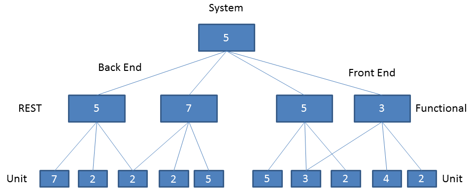

# Friday Quiz for 22 April 2016
For today's quiz we are describing a theoretical and complex system containing two Front-End components and two Back-End components.
The components have each their own set landscape of written code (frameworks, libraries, etc.) which can be shared in the components.

This diagram shows the relation between the parts of the system and the complexity of it. The bottom layer are the programmed units. You could think of them
as a class each containing a set of methods. As with traditional unit testing each method has its own unit test. Thus the number represents a quantity of unit tests.

On the middle layer you see functional components. Components are integrations of separate units creating a functionally complete system. These are tested
by measuring them against functional acceptance criteria or functional test scenarios. The number here represents a functional test scenario.

The top layer represents the system as a whole. A system is an integration of functional components. The number in the system represents the customer journeys
created using the components. These customer journeys are tested using high level tests that measure if you can navigate from one state to the other.

* Each number represents a test
* Each line between the system needs to be covered with one integration test

## The developers
For this system the developers have been very disciplined and wrote unit tests for all their code.

## The testers
All the functionality is covered with functional tests for the Front-End and API tests for the Back-End.

## Functional Maintenance
The team that maintains and runs the applications have put all customer journeys in journey tests.

### Q1: In this scenario how many tests need to be run to cover the full complexity of the system

## Event one: no unit tests
We found out that the developers have been cheating when writing their unit tests, making them unreliable. Therefore, the test manager decided to switch them all
 off and compensate for them with other tests. The complexity, however, remains the same.

### Q2a: Now that you have to test the full complexity of the system throught the functional components. How many tests do you need to run to get every possible permutation covered in a test - measuring the full complexity of the system?
### Q2b: Where did the test manager move the test load to?

## Event two: no component tests
A disaster happened, the test tooling for functional component testing cannot be used anymore. So we can only test the full complexity of the system through the system tests.

### Q3: How many tests need to run at system level to measure the full complexity of the system (i.e. calculate all possibule states of the system)?
### Bonus question: What would you do to regain the confidence in the reliability of the system and the quality of the code?
